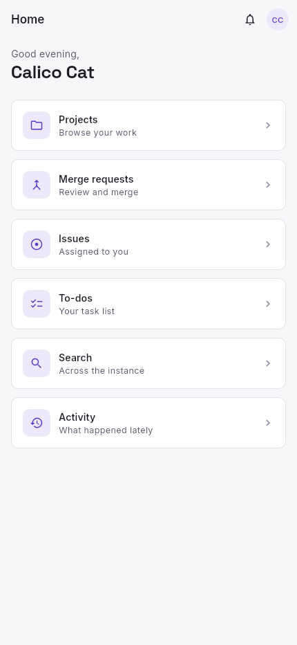
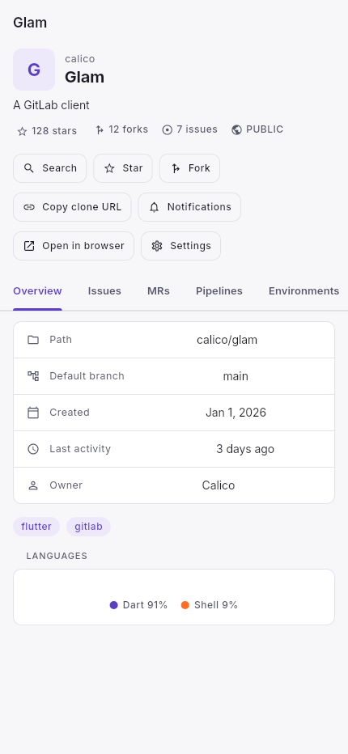
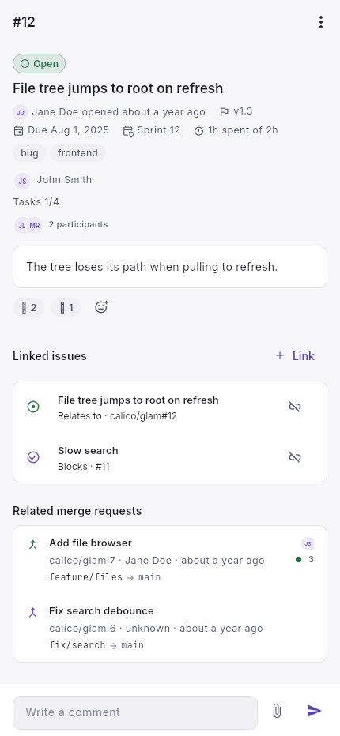
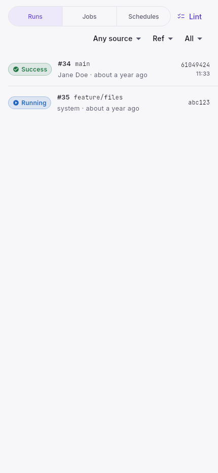
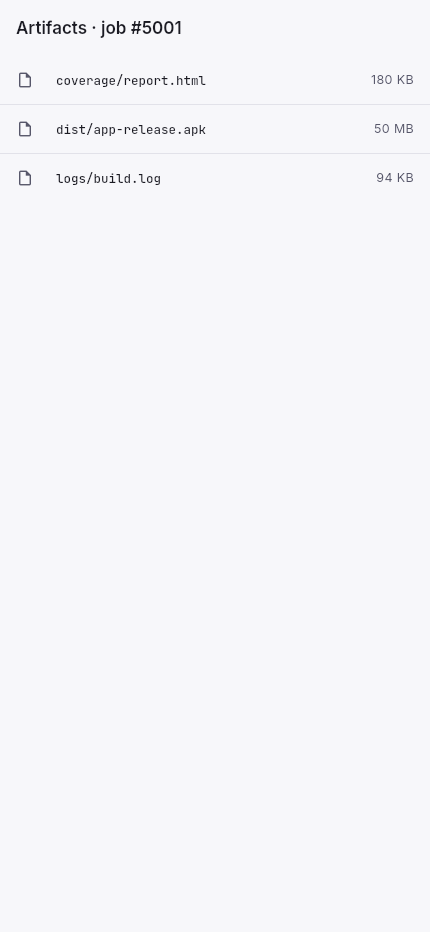
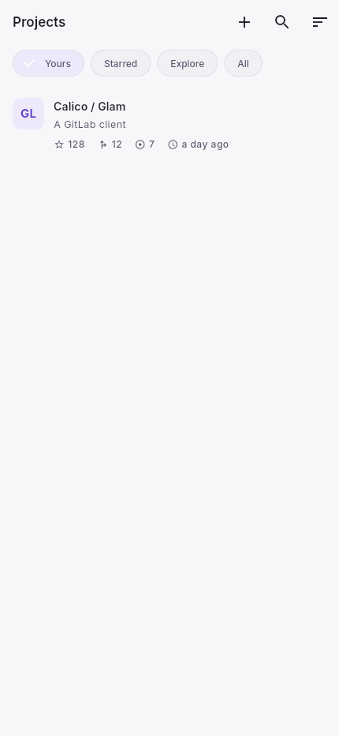
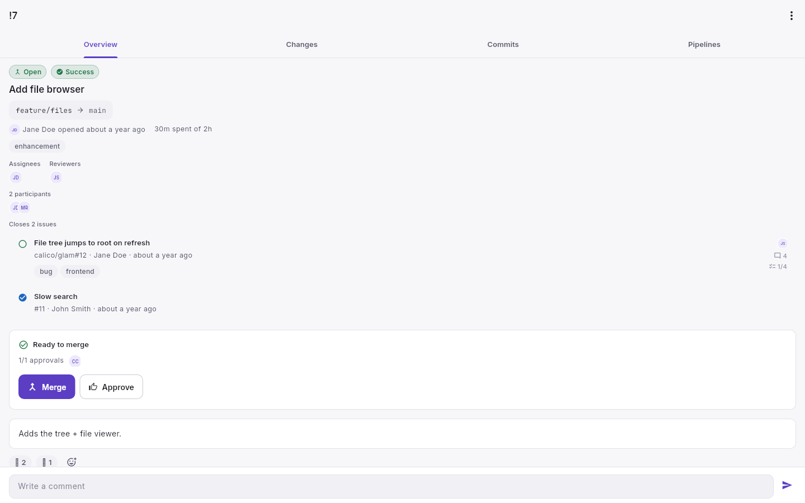

# Glam

A GitLab client for desktop and mobile, written in Flutter. Works against
gitlab.com or any self-hosted instance over the REST v4 API.

<p>
  
  
  
</p>
<p>
  
  
  
</p>
<p>
  
</p>

## What it covers

- **Projects**: browse and search, star/fork, file tree with blame,
  branches/tags/compare, releases, packages and container registry,
  languages breakdown.
- **Issues**: lists with filters, create/edit, labels, milestones,
  iterations, weight, task lists, issue links, related merge requests,
  clone and move, comments with reactions.
- **Merge requests**: overview/discussions/changes tabs, inline diff
  comments, pending review drafts with publish, approvals and approvers,
  draft toggle, assignee/reviewer editing, rebase, merge-when-pipeline-succeeds,
  cherry-pick and revert, pipelines tab with run.
- **CI/CD**: pipelines and jobs with live trace, retry/cancel/play/erase,
  artifact browsing and download (with a zip fallback on older instances),
  schedules with variables, triggers, CI lint.
- **Groups**: projects and subgroups, members, group iterations.
- **Administration**: webhooks, deploy keys and tokens, protected branches
  and tags, project runners, CI variables.
- **Account**: profile, SSH keys, personal access tokens, notification
  settings, todos, activity, snippets, wiki, boards, labels, milestones,
  global search.

The sign-in screen takes a personal access token; it's stored in the
platform's secure storage and never leaves the device except to the
instance you point at.

## Getting started

```
flutter pub get
flutter run            # picks a connected device
flutter run -d linux   # or macos, windows, android, ios
```

On first launch, enter your instance URL (e.g. `gitlab.com` or a
self-hosted host) and a personal access token with `api` scope.

## Install on iPhone or iPad

Every release ships an unsigned `.ipa` that you can sideload with
[AltStore](https://altstore.io) or SideStore:

1. In AltStore open the **Sources** tab and tap **+**.
2. Add this source URL:

   ```
   https://gitlab.com/HttpAnimations/Glam/-/raw/main/altstore/apps.json
   ```

3. Open the **Glam** source and install the version you want.

You can also open
`altstore://source?url=https://gitlab.com/HttpAnimations/Glam/-/raw/main/altstore/apps.json`
on the device to add it in one tap. The source updates itself: each
release pipeline adds the new `.ipa` to `altstore/apps.json`.

## Layout

Feature-first under `lib/src/features/<name>/`, each split into
`domain` (models), `data` (repositories hitting the REST API),
`application` (Riverpod providers), and `presentation` (screens).
Shared infrastructure (the API client, storage, formatting, common
widgets) lives under `lib/src/core/`.

State flows through Riverpod `Notifier`/`AsyncNotifier` classes; widgets
stay dumb. Networking is a thin `GitLabApiClient` over Dio that decodes
through caller-provided functions, so repositories own their own JSON
contracts.

## Testing

```
flutter test
flutter test test/goldens --update-goldens   # regenerate screenshots
```

Around 400 tests. Repositories and providers run against a fake Dio
adapter with real JSON payloads under `test/fixtures/json/`; screens are
covered by golden tests under `test/goldens/` that render with the real
theme and bundled fonts. The images above come from that harness.

## License

[AGPLv3](LICENSE)
